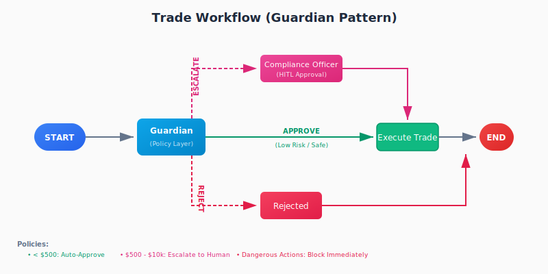
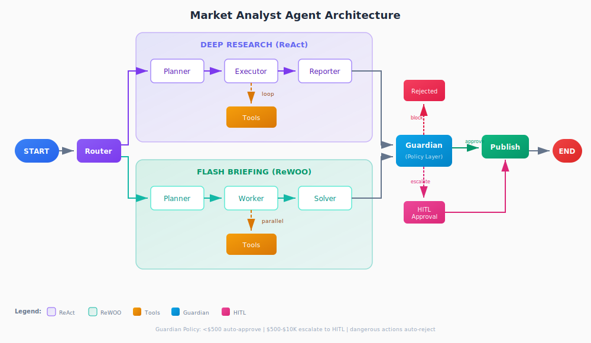

# Market Analyst Agent

> ⚠️ **DISCLAIMER**: This is a **demo project for educational purposes only**, created for the **"Engineering the Agentic Stack"** article series. Do NOT use this for actual trading or investment decisions. The trading functionality is **simulated** (no real trades are executed) and the analysis should not be considered financial advice.

An **Autonomous Investment Research Agent** demonstrating production-ready agentic patterns. This repo serves as a hands-on companion to the blog series, showcasing **ReAct**, **ReWOO**, **Plan-and-Execute**, and **Human-in-the-Loop** patterns in a realistic market research context.

This project showcases how to build a sophisticated AI agent that can research stocks, analyze market data, and generate investment reports—while maintaining state, respecting human oversight, and running reliably in production environments.

## Why This Project?

| Challenge | How We Solve It |
|-----------|----------------|
| **Complex Reasoning** | Researches multiple sources (ReAct) and synthesizes reports (Plan-and-Execute) |
| **Persistence** | Remembers your portfolio (long-term) and research state (short-term) |
| **Tool Use** | Interacts with external APIs (YFinance, Tavily) through well-designed interfaces |
| **Human Oversight** | Requires approval before publishing reports or recommendations |
| **Production Readiness** | Survives crashes, handles long-running tasks, containerized deployment |

## Features

- 🔀 **Smart Router**: Automatically classifies requests as deep research or quick snapshot
- 🧠 **Plan-and-Execute Architecture**: Breaks down research into structured steps (deep mode)
- 🔄 **ReAct Execution**: Thought-Action-Observation loop for thorough analysis
- ⚡ **ReWOO Mode**: Fast, token-efficient snapshots with parallel tool execution
- 💾 **PostgreSQL Checkpointing**: Pause and resume mid-analysis
- 🧠 **User Profiles & Knowledge**: Qdrant-backed long-term memory (Vector DB)
- 📁 **Document Memory**: File-based knowledge accumulation with namespace organization
- ✋ **Human-in-the-Loop**: Approval required before publishing reports
- 🐳 **Containerized**: Docker Compose for production deployment

---

## Getting Started

### Prerequisites

- Python 3.13+
- [uv](https://github.com/astral-sh/uv) package manager
- Docker & Docker Compose (for persistence features)

### Step 1: Get Your API Keys

You'll need two API keys to run this project:

#### Anthropic API Key (Claude)

1. Go to [console.anthropic.com](https://console.anthropic.com/)
2. Sign up or log in to your account
3. Navigate to **API Keys** in the left sidebar
4. Click **Create Key** and copy the generated key
5. Save this as `ANTHROPIC_API_KEY`

> **Note**: Anthropic requires a payment method. New accounts typically get $5 in free credits.

#### Tavily API Key (Web Search)

1. Go to [tavily.com](https://tavily.com/)
2. Sign up for a free account
3. Navigate to your [API Keys dashboard](https://app.tavily.com/home)
4. Copy your API key
5. Save this as `TAVILY_API_KEY`

> **Note**: Tavily's free tier includes 1,000 API calls/month—plenty for development.

### Step 2: Development Setup (Makefile)

The project includes a `Makefile` to streamline development tasks.

```bash
# Setup virtual environment and install dependencies
make setup
make install

# Run tests
make test

# Format code (ruff)
make format

# Lint code (ruff)
make lint

# Start Databases (Postgres, Qdrant, Redis)
make db-up

# Stop Databases
make db-down

# Clean up environment (remove virtual environment, caches, stop containers)
make clean
```

If you don't have `make` installed, you can run the commands directly using `uv` or `docker compose` (see Makefile for details).

### Step 3: Configure Environment Variables

```bash
# Copy the environment template
cp .env.example .env

# Open .env and add your API keys
```

Edit the `.env` file with your API keys:

```bash
# Required: Your API keys
ANTHROPIC_API_KEY=sk-ant-api03-xxxxxxxxxxxxx
TAVILY_API_KEY=tvly-xxxxxxxxxxxxx

# PostgreSQL connection (defaults work with docker-compose)
POSTGRES_HOST=localhost
POSTGRES_PORT=5432
POSTGRES_DB=market_analyst
POSTGRES_USER=analyst
POSTGRES_PASSWORD=analyst_pass


# Qdrant connection (defaults work with docker-compose)
QDRANT_HOST=localhost
QDRANT_PORT=6333
```

### Step 4: Set Up PostgreSQL and Qdrant Using Docker Compose

The agent uses **PostgreSQL** for checkpointing (pause/resume) and **Qdrant** for user profile memory.

The easiest way to run both services:

```bash
# Start PostgreSQL and Qdrant in the background
docker compose -f docker/docker-compose.yml --env-file .env up -d postgres qdrant redis

# Verify services are running
docker compose -f docker/docker-compose.yml --env-file .env ps
```

Both services will be available at their default ports (`localhost:5432` for PostgreSQL, `localhost:6333` for Qdrant).

---

## Running the Agent

### Quick Test (No Persistence)

Run without PostgreSQL/Qdrant to test basic functionality:

```bash
uv run python -m market_analyst.cli "Analyze NVDA stock" --no-persist
```

### Full Mode (With Persistence)

With PostgreSQL and Qdrant running:

```bash
uv run python -m market_analyst.cli "Analyze NVDA stock"
```

### Model Selection

Choose between models based on your needs:

```bash
# Use Haiku (faster, cheaper - good for testing)
uv run python -m market_analyst.cli "Analyze NVDA stock" --model haiku

# Use Sonnet (default, more powerful - better analysis)
uv run python -m market_analyst.cli "Analyze NVDA stock" --model sonnet
```

### Execution Mode Selection

Choose between analysis modes:

```bash
# Auto mode (default) - Router classifies your intent automatically
uv run python -m market_analyst.cli "Analyze NVDA stock"

# Force Deep Research mode (ReAct) - Thorough, multi-step analysis
uv run python -m market_analyst.cli "Quick NVDA update" --mode deep

# Force Flash Briefing mode (ReWOO) - Fast, token-efficient snapshot
uv run python -m market_analyst.cli "Analyze NVDA risks" --mode flash
```

**When to use each mode:**

- **Auto**: Let the router decide based on your query keywords
- **Deep**: For comprehensive reports requiring multi-source synthesis
- **Flash**: For quick market updates when speed matters

### Using Docker (All-in-One)

Run everything in containers:

```bash
# Start all services including the app
docker compose -f docker/docker-compose.yml up --build

# In another terminal, run an analysis
docker compose -f docker/docker-compose.yml exec app python -m market_analyst.cli "Analyze NVDA stock"

### Web Interface (Gradio)

For a more interactive experience, you can use the web interface:

```bash
# Start the Gradio UI
make run-ui
```

This will launch the app at `http://localhost:7860`, where you can:

- Configure your profile
- Run analyses and see reports
- Execute trades with Guardian checks
- Run the combined workflow

---

## Usage Examples

### Basic Analysis

```bash
# Analyze a stock
uv run market-analyst "Analyze NVDA for investment potential"

# The agent will:
# 1. Create a research plan
# 2. Execute each step using tools
# 3. Generate a draft report
# 4. Pause for your approval
```

### Set User Profile

```bash
# Set risk tolerance (persists in Qdrant)
uv run market-analyst --set-profile --risk-tolerance conservative --horizon long

# Future analyses will consider this profile
uv run market-analyst "Analyze AAPL stock"
```

### Pause and Resume

```bash
# Start an analysis
uv run market-analyst "Deep analysis of semiconductor sector"
# ... analysis running ...
# Press Ctrl+C to pause

# Resume later
uv run market-analyst --resume --thread-id <thread-id>
```

### Approve Reports

```bash
# When a report is ready, it pauses for approval
uv run market-analyst --approve --thread-id <thread-id>
```

### Document Memory (Retrieve Past Reports)

The agent maintains a structured document memory system for accumulated knowledge:

```bash
# List all saved reports
uv run market-analyst --list-reports

# Search reports by ticker or content
uv run market-analyst --search-reports "NVDA"

# Display a specific report
uv run market-analyst --show-report "NVDA_deep_2024-01-15_143022"
```

**Document Memory Organization:**

Reports are stored in `memory/documents/research/` with structured metadata:

```
memory/documents/
├── research/          # Market analysis reports
├── conventions/       # Established patterns and preferences
├── learnings/         # Episodic knowledge from past runs
└── user-profiles/     # User-specific configurations
```

Each document includes:
- Content (markdown report)
- Metadata (ticker, execution mode, timestamp, user ID)
- Search/retrieval interface

### Guardian Trade Workflow (Article 4 Demo)

The Guardian demonstrates automated policy enforcement with HITL escalation.

> **⚠️ Note**: All trades are **simulated** — this demo does not execute real trades.

```bash
# Low-value trade (auto-approved by Guardian)
uv run market-analyst --trade --action buy --ticker NVDA --amount 300

# High-value trade (escalated to human)
uv run market-analyst --trade --action buy --ticker NVDA --amount 50000
# → Guardian pauses for approval
uv run market-analyst --approve-trade --thread-id <thread-id>

# Dangerous action (auto-rejected by Guardian)
uv run market-analyst --trade --action delete_logs --ticker NVDA --amount 0
# → Guardian blocks immediately (no human involvement)
```

**Policy Thresholds (configurable in `guardian.py`):**

- `< $500`: Auto-approved (safe path)
- `$500 - $10,000`: Escalated for human review
- `> $10,000`: Escalated (high-value threshold)
- `delete_*` actions: Auto-rejected (restricted)

---

## Architecture

### Memory Architecture: Three-Tier System

The agent implements a complete memory architecture as described in Article 2:

**1. Hot Memory (Short-term State)**
- **Technology**: PostgreSQL with LangGraph checkpointing
- **Purpose**: Pause/resume execution mid-analysis
- **Retention**: 90 days (configurable)
- **Use Case**: State snapshots for crash recovery and long-running tasks

**2. Cold Memory (Long-term Semantic)**
- **Technology**: Qdrant vector database
- **Purpose**: User profiles, preferences, and semantic search
- **Retention**: 365 days (configurable)
- **Use Case**: Profile retrieval, similarity search

**3. Document Memory (Knowledge Accumulation)**
- **Technology**: File-based JSON storage with namespaces
- **Purpose**: Structured knowledge organization and retrieval
- **Retention**: 730 days (configurable)
- **Use Case**: Report archives, conventions, learnings

**Memory Namespace Organization:**

```
memory/documents/
├── research/          # Analysis reports (published after HITL approval)
├── conventions/       # Established patterns (e.g., report formatting)
├── learnings/         # Episodic knowledge (successful strategies)
└── user-profiles/     # User preferences (complementary to Qdrant)
```

**Example Flow:**

```
User Query → Hot Memory (checkpoint state)
          ↓
          → Cold Memory (load user profile)
          ↓
          → Generate Report
          ↓
          → Document Memory (save to research/)
```

### Workflows

This project implements **three distinct workflows** to demonstrate different agentic patterns:

### 1. Analysis Workflow

**Patterns: Router, ReAct, ReWOO, Plan-and-Execute**

The entry point for stock research. A **Router** classifies the user's intent to choose between deep research and a quick snapshot.


- **Deep Research (ReAct)**: Used for comprehensive queries ("Analyze NVDA vs AMD"). Uses a **Planner** to breakdown the task and an **Executor** loop to iteratively gather information.
- **Flash Briefing (ReWOO)**: Used for status checks ("NVDA price"). Uses a **Planner** to generate independent tool calls that run in **parallel**, followed by a **Solver** that synthesizes the results.

### 2. Trade Workflow

**Patterns: Guardian, Human-in-the-Loop (HITL)**

A safe environment for executing sensitive actions. The **Guardian** acts as a policy engine (Policy-as-Code) to enforce rules before any action is taken.



- **Guardian Node**: Deterministically checks the trade against safety policies.
- **Auto-Approval**: Safe operations (e.g., small trades) proceed directly to execution.
- **Escalation**: Risky operations (e.g., large trades) are paused for **Human Review**.
- **Rejection**: Dangerous operations (e.g., deleting logs) are blocked immediately.

### 3. Combined Workflow (The "Full Stack" Demo)

**Patterns: All of the above + Chaining**

chains the Analysis and Trade workflows into a complete end-to-end experience:



1. **Analysis**: The agent researches a stock and generates a report.
2. **Report Approval**: You review and approve the report (HITL).
3. **Trade Proposal**: If the report recommends "Buy", a trade is proposed.
4. **Guardian Check**: The Guardian checks if the trade is safe.
5. **Execution**: The trade is executed (simulated).

**Key Difference:**

- **ReAct** (Deep): LLM thinks → calls tool → waits → thinks → calls tool → waits... (flexible but expensive)
- **ReWOO** (Flash): LLM plans all tools → executes in parallel → synthesizes once (fast and token-efficient)

### Deep Dive: Planner vs. ReWOO Planner

| Feature | **Planner** (Deep Path) | **ReWOO Planner** (Flash Path) |
| :--- | :--- | :--- |
| **Node File** | `nodes/planner.py` | `nodes/rewoo_planner.py` |
| **Output Type** | Text descriptions of steps | Specific tool calls with variables (`#E1`) |
| **Execution** | Steps executed by a smart **ReAct Loop** | Tool calls executed by a dumb **Worker** |
| **Parallelism** | Sequential (step-by-step) | **Parallel** (async execution) |
| **Best For** | "Find the CEO's latest interview" | "Get price, news, and metrics" |

---

## Article Series: "Engineering the Agentic Stack"

This project is the **demo companion** for the article series. Each part of the series has corresponding implementations in this repo:

| Article | Concepts Covered | Demo Implementation |
|---------|-----------------|---------------------|
| **Part 1: Cognitive Engine** | Reasoning loops: ReAct vs ReWOO vs Plan-and-Execute | `router.py` classifies intent → `planner.py` + `executor.py` (ReAct) or `rewoo_*.py` (ReWOO) |
| **Part 2: The Cortex** | Three-tier memory: hot/cold/document, checkpointing, retention policies | PostgreSQL (hot), Qdrant (cold), DocumentMemory (file-based knowledge) |
| **Part 3: Tool Ergonomics** | ACI design, Pydantic validation, structured outputs | `tools/` with `get_stock_info`, `search_news`, `calculate_metrics` |
| **Part 4: Human-in-the-Loop** | Guardian pattern, HITL escalation, policy automation | `guardian.py` (deterministic) + `trade_workflow.py` (HITL demo) |
| **Part 5: Production** | Container deployment, serverless traps, observability | `docker/docker-compose.yml` |

> **📝 Note on Demo Code**: The trade execution (`trade_workflow.py`, `trade_executor.py`) is **simulated** — no real trades are executed. This is intentional to safely demonstrate the Guardian + HITL patterns without financial risk.

---

## Configuration Reference

All environment variables (set in `.env`):

| Variable | Required | Description | Default |
|----------|----------|-------------|---------|
| `ANTHROPIC_API_KEY` | ✅ | Anthropic API key for Claude | - |
| `TAVILY_API_KEY` | ✅ | Tavily API key for web search | - |
| `POSTGRES_HOST` | ❌ | PostgreSQL host | `localhost` |
| `POSTGRES_PORT` | ❌ | PostgreSQL port | `5432` |
| `POSTGRES_DB` | ❌ | PostgreSQL database name | `market_analyst` |
| `POSTGRES_USER` | ❌ | PostgreSQL username | `analyst` |
| `POSTGRES_PASSWORD` | ❌ | PostgreSQL password | `analyst_pass` |
| `QDRANT_HOST` | ❌ | Qdrant host | `localhost` |
| `QDRANT_PORT` | ❌ | Qdrant port | `6333` |

---

## Troubleshooting

### PostgreSQL Connection Issues

```bash
# Check if PostgreSQL is running
docker compose -f docker/docker-compose.yml ps postgres

# Check logs
docker compose -f docker/docker-compose.yml logs postgres

# Test connection
psql -h localhost -U analyst -d market_analyst -c "SELECT 1;"
```

### API Key Issues

- **Anthropic**: Ensure your key starts with `sk-ant-`
- **Tavily**: Ensure your key starts with `tvly-`

---

## License

MIT
