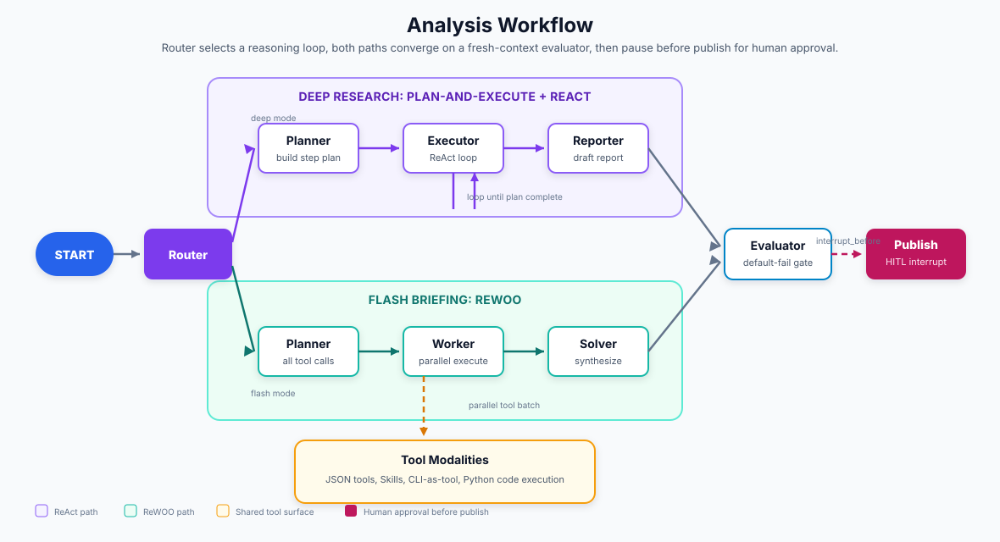
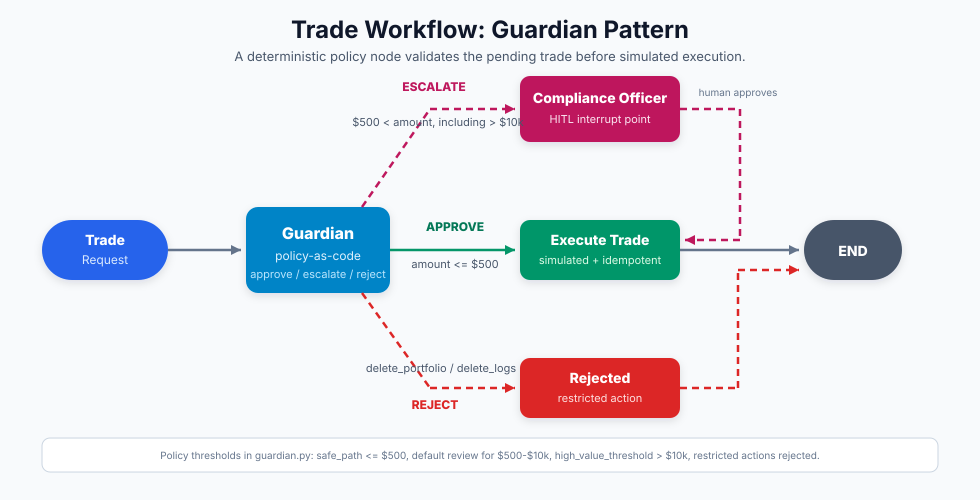
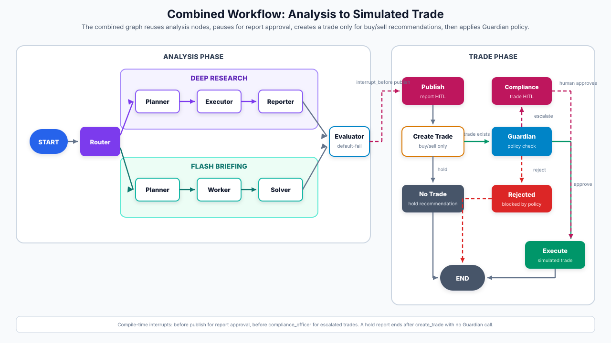

# Market Analyst Agent

> **DISCLAIMER**: This is a **demo project for educational purposes only**, created for the **["Engineering the Agentic Stack"](https://slavadubrov.github.io/blog/)** article series. Do NOT use this for actual trading or investment decisions. The trading functionality is **simulated** (no real trades are executed) and the analysis should not be considered financial advice.

An **Autonomous Investment Research Agent** demonstrating production-ready agentic patterns. This repo serves as a hands-on companion to the blog series, showcasing multiple **reasoning loops**, **memory tiers**, and **tool modalities** in a realistic market research context.

## What This Project Demonstrates

This project implements the full agentic stack across three dimensions:

| Dimension | What's Implemented | Article |
|-----------|-------------------|---------|
| **Reasoning** | ReAct, ReWOO, Plan-and-Execute, Router | [Part 1: The Cognitive Engine](https://slavadubrov.github.io/blog/2026/01/31/the-cognitive-engine-choosing-the-right-reasoning-loop/) |
| **Memory** | Hot (PostgreSQL), Cold (Qdrant), Document (file-based) | [Part 2: The Cortex](https://slavadubrov.github.io/blog/2026/02/14/the-cortex--architecting-memory-for-ai-agents/) |
| **Tools** | JSON Tool Calling, Skills, CLI-as-Tool, Code Execution | [Part 3: The Hands](https://slavadubrov.github.io/blog/2026/03/24/the-hands--tool-ergonomics-and-the-agent-computer-interface/) |
| **Safety** | Guardian pattern, HITL escalation, policy automation | [Part 4: The Guardians](https://slavadubrov.github.io/blog/2026/04/20/the-guardians--why-agent-security-is-not-llm-safety/) |
| **Habitat** | OTel + GenAI conventions, MCP sidecar, idempotency, evaluator, queue+worker, debug bundles | [Part 5: The Habitat](https://slavadubrov.github.io/blog/2026/05/22/the-habitat-running-agents-for-hours-not-seconds/) |

---

## Architecture

### Reasoning Loops (Part 1)

The agent supports multiple reasoning strategies, selected automatically by a **Router** or forced via `--mode`:

| Mode | Pattern | How It Works | Best For |
|------|---------|-------------|----------|
| **Deep** | Plan-and-Execute + ReAct | Planner breaks task into steps, Executor runs each step with a Thought-Action-Observation loop | Comprehensive multi-source analysis |
| **Flash** | ReWOO | Planner generates all tool calls upfront, Worker executes in parallel, Solver synthesizes once | Quick market snapshots |
| **Auto** | Router | LLM classifies query intent and selects Deep or Flash automatically | Default — lets the agent decide |

**Key Difference:**
- **ReAct** (Deep): LLM thinks -> calls tool -> observes -> thinks -> calls tool... (flexible but expensive)
- **ReWOO** (Flash): LLM plans all tools -> executes in parallel -> synthesizes once (fast and token-efficient)

### Memory Architecture (Part 2)

Three-tier memory system with different retention policies:

| Tier | Technology | Purpose | Retention |
|------|-----------|---------|-----------|
| **Hot Memory** | PostgreSQL + LangGraph checkpointing | Pause/resume execution, crash recovery | 90 days |
| **Cold Memory** | Qdrant vector database | User profiles, preferences, semantic search | 365 days |
| **Document Memory** | File-based JSON with namespaces | Report archives, conventions, learnings | 730 days |

```
memory/documents/
├── research/          # Analysis reports (published after HITL approval)
├── conventions/       # Established patterns (e.g., report formatting)
├── learnings/         # Episodic knowledge (successful strategies)
└── user-profiles/     # User preferences (complementary to Qdrant)
```

### Tool Modalities (Part 3)

The agent demonstrates **four distinct tool modalities**, following [ACI (Agent-Computer Interface)](https://arxiv.org/abs/2405.15793) design principles:

| # | Modality | Implementation | Tools | Token Overhead |
|---|----------|---------------|-------|---------------|
| 1 | **JSON Tool Calling** | `@tool` + Pydantic schemas | `get_stock_snapshot`, `get_price_history`, `get_financials`, `search_news`, `search_competitors` | ~4,500 tokens (5 tool schemas) |
| 2 | **Skills (SKILL.md)** | Markdown files with YAML frontmatter | `use_skill` -> `earnings_analysis`, `sector_comparison` playbooks | ~100 tokens (metadata only at startup) |
| 3 | **CLI-as-Tool** | Subprocess wrapper around own CLI | `cli_list_reports`, `cli_show_report` (agent calls `market-analyst --json`) | Near zero (no schema) |
| 4 | **Code Execution (PTC)** | `PythonAstREPLTool` with safety guards | `execute_python_analysis` for ratio calculations, CAGR, portfolio math | ~200 tokens (1 tool schema) |

**ACI Design Principles Applied:**
- **Tool consolidation**: 10+ granular tools -> 5 high-level tools (62% schema reduction)
- **Pydantic validation**: Input guardrails catch bad tickers/periods before API calls
- **Structured outputs**: Every tool returns a model with a `summary` field ready for reports
- **Retry logic**: Tenacity decorators with exponential backoff on all external API calls

### Workflows

**1. Analysis Workflow** — Router -> [ReAct or ReWOO] -> Reporter/Solver -> Evaluator -> Publish (with HITL approval)



**2. Trade Workflow** — Guardian policy engine -> Auto-approve / Escalate to Compliance Officer / Reject



**3. Combined Workflow** — Analysis -> Evaluator -> Report Approval -> Create Trade -> Guardian -> Trade Execution



---

## Getting Started

### Prerequisites

- Python 3.13+
- [uv](https://github.com/astral-sh/uv) package manager
- Docker & Docker Compose (for persistence features)

### Step 1: Get Your API Keys

#### Model API Key

Configure either `OPENAI_API_KEY` from [platform.openai.com](https://platform.openai.com/api-keys) or `ANTHROPIC_API_KEY` from [console.anthropic.com](https://console.anthropic.com/). When both are present, the default `auto` provider uses OpenAI; set `MARKET_ANALYST_PROVIDER=anthropic` to force Claude.

Both providers require API billing; ChatGPT and Claude subscriptions do not include API usage.

#### Tavily API Key (Web Search)

1. Go to [tavily.com](https://tavily.com/)
2. Sign up for a free account
3. Navigate to your [API Keys dashboard](https://app.tavily.com/home)
4. Copy your API key
5. Save this as `TAVILY_API_KEY`

> **Note**: Tavily's free tier includes 1,000 API calls/month — plenty for development.

### Step 2: Development Setup

```bash
# Setup virtual environment and install dependencies
make setup
make install

# Run tests
make test

# Format and lint code
make format
make lint

# Start databases (Postgres, Qdrant, Redis)
make db-up

# Stop databases
make db-down
```

If you don't have `make` installed, you can run the commands directly using `uv` or `docker compose` (see Makefile for details).

### Step 3: Configure Environment Variables

```bash
cp .env.example .env
```

Edit `.env` with your API keys:

```bash
ANTHROPIC_API_KEY=sk-ant-api03-xxxxxxxxxxxxx
# Or use OpenAI (preferred when both keys are present):
OPENAI_API_KEY=sk-xxxxxxxxxxxxx
TAVILY_API_KEY=tvly-xxxxxxxxxxxxx

# PostgreSQL (defaults work with docker-compose)
POSTGRES_HOST=localhost
POSTGRES_PORT=5432
POSTGRES_DB=market_analyst
POSTGRES_USER=analyst
POSTGRES_PASSWORD=analyst_pass

# Qdrant (defaults work with docker-compose)
QDRANT_HOST=localhost
QDRANT_PORT=6333
```

### Step 4: Start Infrastructure

```bash
docker compose -f docker/docker-compose.yml --env-file .env up -d postgres qdrant redis
```

---

## Usage

### Basic Analysis

```bash
# Quick test without databases
uv run market-analyst "Analyze NVDA stock" --no-persist

# Full mode with persistence
uv run market-analyst "Analyze NVDA stock"

# Force a specific reasoning mode
uv run market-analyst "Analyze NVDA stock" --mode deep    # ReAct (thorough)
uv run market-analyst "NVDA price update" --mode flash    # ReWOO (fast)

# Choose model
uv run market-analyst "Analyze NVDA stock" --model haiku  # Faster, cheaper
uv run market-analyst "Analyze NVDA stock" --model sonnet # More powerful
```

### User Profiles

```bash
# Set risk tolerance (persists in Qdrant)
uv run market-analyst --set-profile --risk-tolerance conservative --horizon long

# Future analyses will consider this profile
uv run market-analyst "Analyze AAPL stock"
```

### Pause, Resume, and Approve

```bash
# Start an analysis (Ctrl+C to pause)
uv run market-analyst "Deep analysis of semiconductor sector"

# Resume later
uv run market-analyst --resume --thread-id <thread-id>

# Approve a draft report
uv run market-analyst --approve --thread-id <thread-id>
```

### Document Memory

```bash
# List all saved reports
uv run market-analyst --list-reports

# JSON output (for machine consumption / CLI-as-Tool modality)
uv run market-analyst --list-reports --json

# Search reports by ticker
uv run market-analyst --search-reports "NVDA"

# Display a specific report
uv run market-analyst --show-report "NVDA_deep_2024-01-15_143022"
```

### Guardian Trade Workflow

> **All trades are simulated** — no real trades are executed.

```bash
# Low-value trade (auto-approved by Guardian)
uv run market-analyst --trade --action buy --ticker NVDA --amount 300

# High-value trade (escalated to human)
uv run market-analyst --trade --action buy --ticker NVDA --amount 50000
uv run market-analyst --approve-trade --thread-id <thread-id>

# Dangerous action (auto-rejected by Guardian)
uv run market-analyst --trade --action delete_logs --ticker NVDA --amount 0
```

### Combined Workflow (Full Demo)

```bash
# Analysis -> Evaluator -> Report Approval -> Create Trade -> Guardian -> Trade
uv run market-analyst "Analyze NVDA for investment" --combined --trade-amount 5000
```

### Web Interface

```bash
make run-ui
# Opens at http://localhost:7860
```

---

## Project Structure

```
src/market_analyst/
├── nodes/
│   ├── router.py              # Intent classification (deep vs flash)
│   ├── planner.py             # Research plan generation (ReAct path)
│   ├── executor.py            # Step execution with ReAct loop
│   ├── rewoo_planner.py       # Upfront tool planning (ReWOO path)
│   ├── rewoo_worker.py        # Parallel tool execution
│   ├── rewoo_solver.py        # Result synthesis
│   ├── reporter.py            # Report generation
│   ├── guardian.py            # Policy-as-Code safety layer
│   └── trade_executor.py      # Simulated, idempotent trade execution
├── tools/
│   ├── stock.py               # JSON tools: get_stock_snapshot, get_price_history, get_financials
│   ├── search.py              # JSON tools: search_news, search_competitors
│   ├── trade.py               # JSON tools: execute_trade
│   ├── skills.py              # Skills modality: SKILL.md loader + use_skill tool
│   ├── cli_tools.py           # CLI modality: cli_list_reports, cli_show_report
│   └── code_exec.py           # Code execution modality: execute_python_analysis
├── workflows/
│   ├── analysis_workflow.py   # Main analysis graph
│   ├── trade_workflow.py      # Guardian + HITL trade graph
│   └── combined_workflow.py   # End-to-end chained workflow
├── runtime/
│   ├── evaluator.py           # Fresh-context report evaluator
│   ├── queue.py               # Redis Streams queue producer/consumer helpers
│   ├── worker.py              # Background worker loop
│   └── harness.py             # Runtime wrapper for CLI and worker runs
├── memory/                    # Hot, cold, and document memory implementations
├── mcp_server/                # MCP sidecar exposing data tools
├── observability/             # OTel tracing, metrics, and budget callbacks
├── schemas.py                 # Pydantic state models
├── cli.py                     # CLI entry point
└── app.py                     # Gradio web UI
skills/
├── earnings_analysis.md       # Earnings analysis playbook (SKILL.md format)
└── sector_comparison.md       # Sector comparison framework
```

---

## Article Series: "Engineering the Agentic Stack"

| Article | Concepts | Demo Implementation |
|---------|----------|---------------------|
| [**Part 1: The Cognitive Engine**](https://slavadubrov.github.io/blog/2026/01/31/the-cognitive-engine-choosing-the-right-reasoning-loop/) | Reasoning loops: ReAct vs ReWOO vs Plan-and-Execute | `router.py` -> `planner.py` + `executor.py` (ReAct) or `rewoo_*.py` (ReWOO) |
| [**Part 2: The Cortex**](https://slavadubrov.github.io/blog/2026/02/14/the-cortex--architecting-memory-for-ai-agents/) | Three-tier memory, checkpointing, retention policies | PostgreSQL (hot), Qdrant (cold), DocumentMemory (file-based) |
| [**Part 3: The Hands**](https://slavadubrov.github.io/blog/2026/03/24/the-hands--tool-ergonomics-and-the-agent-computer-interface/) | ACI design, 4 tool modalities, Pydantic validation | `tools/` — JSON, Skills, CLI-as-Tool, Code Execution |
| [**Part 4: The Guardians**](https://slavadubrov.github.io/blog/2026/04/20/the-guardians--why-agent-security-is-not-llm-safety/) | Guardian pattern, HITL escalation, policy automation | `guardian.py` + `trade_workflow.py` |
| [**Part 5: The Habitat**](https://slavadubrov.github.io/blog/2026/05/22/the-habitat-running-agents-for-hours-not-seconds/) | Session/harness/sandbox/checkpoint/trace primitives; OTel + GenAI conventions; idempotency; debug bundles; queue+worker shape; MCP sidecar | `observability/`, `runtime/`, `mcp_server/`, `docker/observability/`, queue worker (`runtime/worker.py`) |

---

## Configuration Reference

| Variable | Required | Description | Default |
|----------|----------|-------------|---------|
| `ANTHROPIC_API_KEY` | One provider required | Anthropic API key for Claude | - |
| `OPENAI_API_KEY` | One provider required | OpenAI API key; preferred when both keys are set | - |
| `MARKET_ANALYST_PROVIDER` | No | `auto`, `openai`, or `anthropic` | `auto` |
| `TAVILY_API_KEY` | Yes | Tavily API key for web search | - |
| `POSTGRES_HOST` | No | PostgreSQL host | `localhost` |
| `POSTGRES_PORT` | No | PostgreSQL port | `5432` |
| `POSTGRES_DB` | No | PostgreSQL database name | `market_analyst` |
| `POSTGRES_USER` | No | PostgreSQL username | `analyst` |
| `POSTGRES_PASSWORD` | No | PostgreSQL password | `analyst_pass` |
| `QDRANT_HOST` | No | Qdrant host | `localhost` |
| `QDRANT_PORT` | No | Qdrant port | `6333` |

---

## Part 5: The Habitat — Runtime, Observability, Production-Hardening

Part 5 covers everything that lives *outside* the agent: durable sessions,
crash-safe checkpoints, sandboxes, traces, and the production-grade plumbing
that turns a 30-second request handler into a six-hour background worker.

### The five primitives (article §"Five Primitives")

| Primitive | Where it lives in this repo |
|-----------|------------------------------|
| **Session** | LangGraph `thread_id` + PostgreSQL `PostgresSaver` (`src/market_analyst/memory/postgres_store.py`) |
| **Harness** | `runtime/harness.py` + the LangGraph `StateGraph` in `workflows/` |
| **Sandbox** | Per-thread workspace at `./workspaces/${THREAD_ID}` (`runtime/workspace.py`) |
| **Checkpoint** | Same `PostgresSaver`, optionally wrapped with `EncryptedSerializer` |
| **Trace** | OpenTelemetry GenAI spans emitted by `observability/langchain_callback.py` |

### Failure mitigations (article §"Failure Modes the Runtime Has to Handle")

| Failure mode | Where the mitigation lives |
|--------------|----------------------------|
| Premature completion | `runtime/evaluator.py` — fresh-context evaluator subagent (default-FAIL) |
| Stuck loops / retry storms | `observability/budget.py` — circuit breaker on consecutive tool errors |
| Runaway token / tool cost | `observability/budget.py` — per-run token + tool-call budgets + kill switch |
| Non-idempotent tool calls | `runtime/idempotency.py` — filesystem-backed key store; trade executor uses it |
| Lost work after crash | LangGraph PostgresSaver checkpoint + `runtime/initializer.py` boot hook |
| Workspace drift | Per-`thread_id` workspace mount |
| Feature amnesia across context windows | `PROGRESS.md` + `feature-list.json` via `runtime/initializer.py` |

### Observability stack

```bash
# Bring up OTel Collector + Tempo + Loki + Prometheus + Grafana
make observability-up

# Then point the worker at the collector
export OTEL_EXPORTER_OTLP_ENDPOINT=http://localhost:4317
export METRICS_ENABLED=true
uv run market-analyst "Analyze NVDA stock"
```

Grafana lands on http://localhost:3000 (anonymous admin, dev only) with a
preloaded *Market Analyst — Overview* dashboard. Prometheus is on :9090,
Tempo on :3200, Loki on :3100. Alert rules in
`docker/observability/alerts.yml` cover budget-kill triggers, tool-error
rate, and slow LLM calls.

Span attributes follow the OpenTelemetry [GenAI semantic conventions](https://opentelemetry.io/docs/specs/semconv/gen-ai/)
(`gen_ai.operation.name`, `gen_ai.provider.name`, `gen_ai.request.model`,
`gen_ai.conversation.id` = the LangGraph `thread_id`, etc.).

### MCP sidecar (secret-broker pattern)

```bash
# Bring up the sidecar that holds API tokens; the worker calls it via MCP
make mcp-up
```

The sidecar (`src/market_analyst/mcp_server/`) re-exposes the data tools
(`get_stock_snapshot`, `search_news`, …) over MCP. Production deployments
pull tokens from Vault / AWS Secrets Manager into the sidecar; the worker
container never sees them.

### Queue + worker shape (article §"Queue + Worker + Checkpoint DB")

```bash
# Producer: any CLI invocation
# Consumer: a dedicated worker loop on Redis Streams
make worker          # starts python -m market_analyst.runtime.worker
make queue-push      # XADDs one test job onto market_analyst:runs
```

`runtime/queue.py` and `runtime/worker.py` implement the queue half. The
worker uses the same `harness_run` context the CLI uses, so a crashed
worker writes the same debug bundle to `./workspaces/${THREAD_ID}/_debug/`
that the CLI would.

### Debug bundle on failure

On any uncaught exception the harness drops a debug bundle:

```
workspaces/<thread_id>/_debug/
├── last_state.json
├── error.txt
├── tool_calls.csv
├── env.txt
├── workspace.tar.gz
└── PROGRESS.md
```

The CLI prints the bundle path on failure — that bundle is what you'd hand
to an oncall engineer (or another agent) when investigating a long-run
failure.

### What has to change before this goes to production

(From the article's "What Has to Change Before This Goes to Production" list.)

1. Move database passwords out of `.env` and into a secrets manager.
2. Replace Grafana's anonymous admin with OAuth / SAML.
3. Enable TLS between every hop that crosses a trust boundary.
4. Pin CPU/RAM limits per service and tune Postgres `shared_buffers`.
5. Wire `pg_basebackup` / `wal-g`; ship Qdrant snapshots to object storage.
6. Mount one volume per `thread_id` (or hand the workspace to a per-task
   Daytona / Runloop sandbox).
7. Move MCP tokens into Vault; the sidecar fetches per session.
8. Set `CHECKPOINT_ENCRYPTION_KEY` and `LANGGRAPH_STRICT_MSGPACK=true` for
   the Postgres checkpointer.

---

## Troubleshooting

### PostgreSQL Connection Issues

```bash
docker compose -f docker/docker-compose.yml ps postgres
docker compose -f docker/docker-compose.yml logs postgres
psql -h localhost -U analyst -d market_analyst -c "SELECT 1;"
```

### API Key Issues

- **Anthropic**: Ensure your key starts with `sk-ant-`
- **Tavily**: Ensure your key starts with `tvly-`

---

## License

MIT
