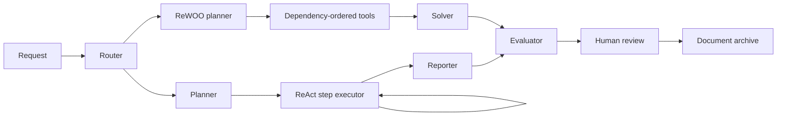

# Market Analyst Agent

Learn how an agent turns a request into tool calls, evidence, a draft, and a review decision. This is the runnable companion to **Engineering the Agentic Stack**. Trading is simulated; the reports are educational examples, not investment advice.

Start with the offline example. It uses the real workflow and checkpoint machinery with synthetic data, so you can understand the control flow before configuring providers or databases.

## Start in three commands

Install [uv](https://docs.astral.sh/uv/getting-started/installation/), then from this checkout:

```bash
uv sync --locked
uv run python examples/offline.py
uv run pytest
```

Python 3.13+ is required; uv can install the project's Python version. The example needs no keys, Docker, or network calls after installation. It executes an injected quote tool, saves a checkpoint, retries the same run without repeating the tool, and stops before publication. Planning and report writing are deterministic fixtures, not model-quality evaluations.

The default tests are offline. Integration tests are explicitly enabled below.

## Run with a model

```bash
cp .env.example .env
```

Set `OPENAI_API_KEY` and, for news searches, `TAVILY_API_KEY`. Restart the CLI/worker process after changing `.env`; restart the Gradio server for UI changes. Do not put credentials in run settings or commit `.env`.

```bash
uv run market-analyst "Give a short NVDA briefing" --mode flash --no-persist
uv run market-analyst "Research NVDA" --mode deep --model gpt-5.6-sol --no-persist
```

`--no-persist` disables database access and publication. It uses a default profile, still writes local progress/debug artifacts, and returns a draft with an evaluator verdict. A failed verdict means the draft needs revision, even if every API request succeeded.

For a small live smoke test that only needs a model key and Yahoo Finance:

```bash
uv run python scripts/live_smoke.py --mode flash
uv run python scripts/live_smoke.py --mode deep
```

These make real API calls. They check execution and evidence collection; they do not assert that the report passes editorial review.

### Choose a provider or deployment

| Setting | Behavior |
| --- | --- |
| `MARKET_ANALYST_PROVIDER=auto` | Default: OpenAI if its key exists, otherwise Anthropic |
| `MARKET_ANALYST_PROVIDER=openai` | Direct OpenAI Responses API; default model `gpt-5.6-luna` |
| `MARKET_ANALYST_PROVIDER=anthropic` | Direct Anthropic adapter; set `ANTHROPIC_API_KEY` |
| `MARKET_ANALYST_PROVIDER=compatible` | OpenAI Chat Completions interface for LiteLLM or another compatible endpoint |
| `MARKET_ANALYST_MODEL` | Provider model ID or gateway deployment name; `--model` overrides it |

Arbitrary names such as `o3` or `team/research-model` are preserved. Historical `sonnet` and `haiku` aliases still work. Models must support tool calling and structured responses; an OpenAI-shaped endpoint alone does not establish feature parity.

**LiteLLM connection:** configure your gateway, then set:

```dotenv
MARKET_ANALYST_PROVIDER=compatible
MARKET_ANALYST_BASE_URL=http://localhost:4000/v1
MARKET_ANALYST_API_KEY=your-gateway-key
MARKET_ANALYST_MODEL=research-model
```

The application's existing OpenAI client can [connect directly to LiteLLM](https://docs.litellm.ai/docs/proxy/user_keys). No embedded LiteLLM dependency is needed. The gateway owns upstream credentials and model routing. Its key is separate from `OPENAI_API_KEY`, so selecting a gateway does not send your OpenAI credential to it.

Direct OpenAI requests retain encrypted reasoning blocks with `store=False`. The ReAct loop uses `langchain.agents.create_agent`; context compaction summarizes older messages while preserving recent tool-call/result pairs. Full tool evidence is collected separately from the model context. The compatible transport uses Chat Completions and does not promise OpenAI-specific reasoning features.

## Follow the code


```mermaid
flowchart LR
    Request --> Router
    Router --> Planner
    Planner --> ReAct[ReAct step executor]
    ReAct --> ReAct
    ReAct --> Reporter
    Router --> ReWOO[ReWOO planner]
    ReWOO --> Tools[Dependency-ordered tools]
    Tools --> Solver
    Reporter --> Evaluator
    Solver --> Evaluator
    Evaluator --> Review[Human review]
    Review --> Archive[Document archive]
```

Any workflow error stops the path before publication. An evaluator `fail` cannot be approved; fix the evidence and start a new run. `needs_human` is explicitly reviewed by the operator. Approval writes a local archive document; it does not publish to a website.

| Module | Read it to learn |
| --- | --- |
| `harness.py` | How model, tools, profile loader, checkpoint store, and graph factory are composed |
| `llm.py` | Immutable run settings and provider adapters |
| `workflows/research.py` | Shared wiring for the two reasoning loops; node replacement for experiments |
| `nodes/` | One readable function per planning, execution, writing, or policy decision |
| `tools/registry.py` | The research tool allowlist shared by both loops |
| `runtime/evidence.py`, `runtime/evaluator.py` | Actual tool evidence, freshness checks, and separate report judgment |
| `memory/` | Checkpoints, exact-match profiles in Qdrant, and a JSON document archive |
| `runtime/queue.py`, `runtime/worker.py` | Redis delivery, pending reclamation, bounded retries, and dead letters |
| `runtime/ownership.py`, `runtime/idempotency.py` | One active writer and durable operation reservation/reconciliation |
| `tools/code_exec.py` | Restricted Docker execution with no local fallback |
| `mcp_server/` | Optional tool server for external MCP clients |

Deep mode is **Plan-and-Execute with a ReAct loop inside each step**. Flash mode is **ReWOO**: plan tool calls first, execute dependency-ready calls, then synthesize. Auto mode asks the router to choose. These are control-flow choices, not a claim that one is generally better.

## Change one component

Use ordinary constructor arguments rather than editing environment variables inside your code:

```python
from langgraph.checkpoint.memory import InMemorySaver
from market_analyst.harness import AgentHarness
from market_analyst.llm import ModelSettings
from market_analyst.schemas import ExecutionMode
from market_analyst.tools.stock import get_stock_snapshot

agent = AgentHarness(
    model=ModelSettings(provider="openai", model="gpt-5.6-luna"),
    tools=(get_stock_snapshot,),
    checkpointer=InMemorySaver(),
)
result = agent.run(
    "Fetch a NVDA snapshot",
    thread_id="example-1",
    mode=ExecutionMode.FLASH_BRIEFING,
)
```

- **Tool:** supply a LangChain `@tool` with validated arguments. Both loops use the same supplied list. ReWOO rejects unknown tools, duplicate IDs, missing dependencies, cycles, and oversized plans before execution. Add effectful operations only behind an explicit approval/idempotency boundary; the research list deliberately excludes trades.
- **Reasoning:** choose `mode`, replace a named node with `partial(create_graph, nodes={...})`, or supply a different `graph_factory(checkpointer=...)`. `examples/offline.py` demonstrates node replacement. Keep the `AgentState` and approval contract when using the existing runner.
- **Profile memory:** pass `profile_loader=my_store.get_profile`. The default harness uses `UserProfile()`; pass a Qdrant loader explicitly when needed.
- **Checkpoint memory:** pass `InMemorySaver()` for a single-process lesson or `get_checkpointer()` for Postgres/Redis. In-memory checkpoints disappear when the process exits.
- **Model:** change `ModelSettings`. Settings and the permitted tool names are saved with the run. Recovery preserves them; custom tools must be supplied again, and the tool surface cannot silently expand.

A new user turn uses a new thread ID. Retrying a delivery uses `retry=True` with the same request, principal, tools, and graph implementation. A queue retry never approves a report.

## Persistence and review

Start only the services you need:

```bash
make db-up
uv run market-analyst "Research NVDA" --mode flash
uv run market-analyst --resume --thread-id <id>
uv run market-analyst --approve --thread-id <id>
uv run market-analyst --list-reports --json
```

The default checkpoint backend is PostgreSQL. `HOT_MEMORY_PROVIDER=redis` selects Redis Stack. An unavailable database is an error; use `--no-persist` explicitly for a draft-only run.

`CHECKPOINT_ENCRYPTION_KEY` enables checkpoint encryption with PostgreSQL. The installed Redis saver does not support this serializer; selecting Redis with an encryption key fails explicitly.

Profiles in Qdrant are exact-match preferences, with placeholder vectors. This is **not semantic recall**. Reads and vector queries require a principal filter and exclude expired records. `delete_profile(user_id)` deletes that principal's records; `purge_expired()` removes expired records physically. Existing profiles without an expiry must be saved again before use. No automatic retention scheduler is claimed.

Reports are written atomically to `memory/documents/research/`, using a stable content key so retries do not create another archive record. The former second copy in `reports/` is no longer written. Workspace paths are directories, not sandboxes.

This is a local operator demo: user IDs are scoping inputs, not authenticated identities. Add authentication and ownership checks before exposing its UI or archive to other users.

### Queue recovery

```bash
make queue-push
make worker
```

The worker reclaims pending entries idle for 60 seconds, resumes committed checkpoints with synchronous durability, and acknowledges successful terminal outcomes or a durable approval wait. Failed deliveries are retried up to three deliveries, then recorded and acknowledged atomically in `<stream>:dead`. Provider intervention goes directly to operator review through the dead-letter record, without another model attempt.

A kernel lock prevents simultaneous writers on the same shared local workspace volume. This supports multiple local processes, not multiple machines or independent container volumes. New input/approval is rejected while a writer is active. SIGTERM finishes the current job; SIGINT in the CLI interrupts it. Use PostgreSQL leases with fencing and an explicit cancellation service before scaling across hosts.

The simulated trade ledger uses SQLite. An application-owned operation ID is bound to the full approved parameters. Completed operations replay; `pending` and `unknown` stop for reconciliation. A crash after an effect but before recording its result never grants permission to repeat it. An operator can record a result confirmed by an external status lookup with `store(...)`. Legacy JSON reservations are not silently migrated or replayed.

### Simulated trades and UI

```bash
uv run market-analyst --trade --action buy --ticker NVDA --amount 300 --no-persist
uv run market-analyst --trade --action buy --ticker NVDA --amount 5000
uv run market-analyst --approve-trade --thread-id <id>
uv run market-analyst "Research NVDA" --combined --trade-amount 1000
make run-ui
```

Guardian auto-approves amounts up to $500, escalates larger amounts, and rejects destructive actions. Combined mode requires persistence and report approval before creating a simulated trade request.

## Optional execution surfaces

**Calculations:** start Docker Desktop and explicitly prepare the image:

```bash
docker pull python:3.13-alpine
```

The calculator runs as a non-root user in a read-only container with no host mounts, no network, no capabilities, no host credentials, CPU/memory/PID limits, a wall-time limit, and bounded output. Missing Docker/image fails closed. Set `MARKET_ANALYST_SANDBOX_IMAGE` to a vetted digest for reproducible deployments. AST validation only improves error messages; it is not the isolation boundary. The app container has no Docker socket; calculation calls from that container consequently fail closed.

**MCP:** `uv run python -m market_analyst.mcp_server` serves stdio. `make mcp-up` exposes Streamable HTTP on localhost:8765. This is an optional server for external clients. The worker calls local tools and has its own credentials; the sidecar is **not a secret broker or isolation boundary**. The checked SDK negotiates protocol `2025-11-25` and exposes five read tools, no trade or code-execution tools.

**Observability:** `make observability-up` starts the optional OTel/Grafana stack. Metrics are observations, not spending authorization. Model timeout, response-token caps, plan-size limits, and graph iteration limits are enforced. The `BudgetTracker` lesson is post-call accounting; a durable reservation/settlement ledger for a hard run-wide token or money limit remains a separate operating contract.

## Verify changes

```bash
make format                 # Ruff import sorting/fixes, then formatting
make check                  # Ruff lint + format check, mypy, offline pytest
uv run python examples/offline.py
uv build

# Docker required; creates and removes isolated Redis/Postgres/Python containers
uv run pytest -m integration
```

The tests cover invalid tool plans, full JSON evidence, unsupported reports, principal isolation/deletion, concurrent operation reservations, a killed Redis consumer, PostgreSQL recovery after process death, provider stop handling, compaction, and MCP negotiation. Live requests are confined to the explicit smoke script.

The GitHub Actions workflow runs the same checks and Docker integration tests without API keys.

Evaluator verdicts remain model judgments, not objective correctness certificates.

## Companion articles

| Part | Article | Main code |
| --- | --- | --- |
| 1 | [Reasoning loops](https://slavadubrov.com/blog/2026/01/31/ai-agent-reasoning-loops/) | `workflows/research.py`, `nodes/` |
| 2 | [Memory](https://slavadubrov.com/blog/2026/02/14/ai-agent-memory-architecture/) | `memory/`, checkpoint recovery |
| 3 | [Tools](https://slavadubrov.com/blog/2026/03/24/ai-agent-tool-use/) | `tools/`, `mcp_server/` |
| 4 | [Security](https://slavadubrov.com/blog/2026/04/20/ai-agent-security/) | Guardian, ownership, sandbox, evidence gates |
| 5 | [Runtime](https://slavadubrov.com/blog/2026/05/26/ai-agent-runtime/) | queue, worker, checkpoints, observability |
| 6 | [Harness engineering](https://slavadubrov.com/blog/2026/07/22/ai-agent-harness-engineering/) | `harness.py`, evaluator, fault tests |

The refreshed articles pin older repository snapshots. Updating their commit links is a separate publication step after this change is reviewed and committed.
